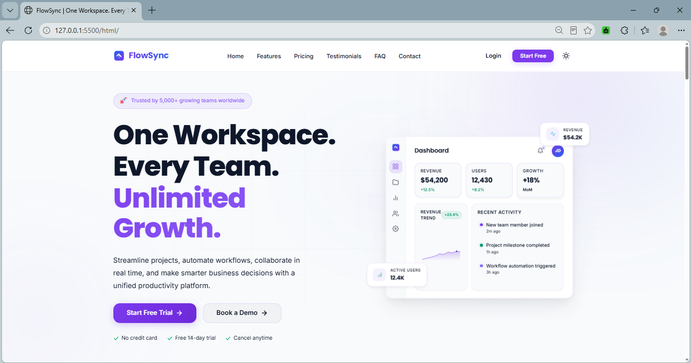
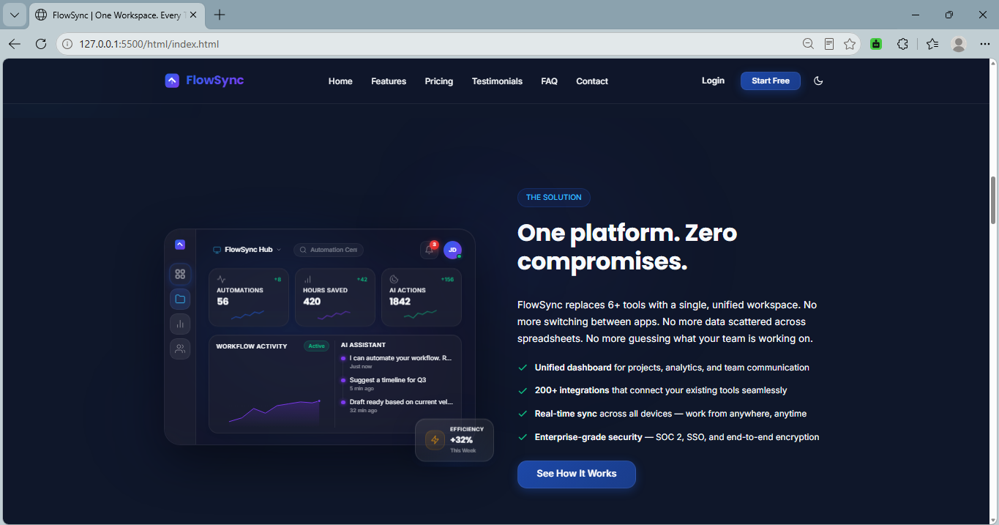
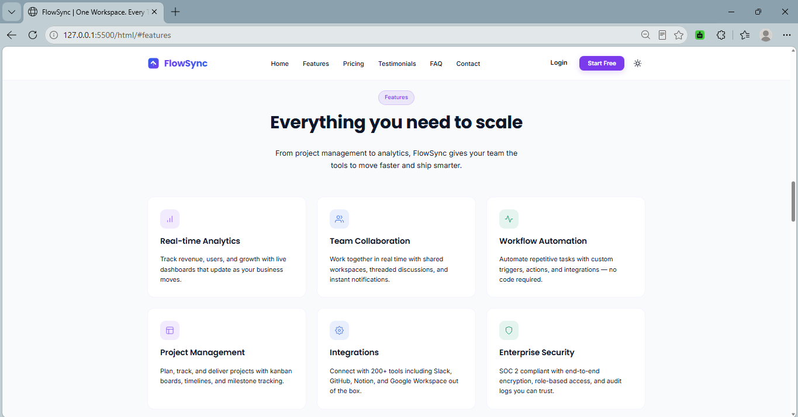
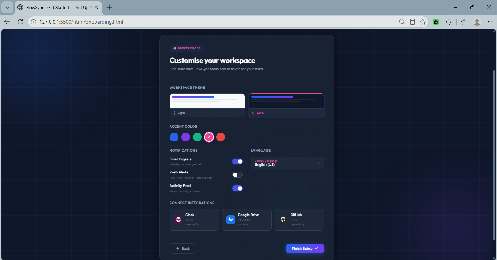
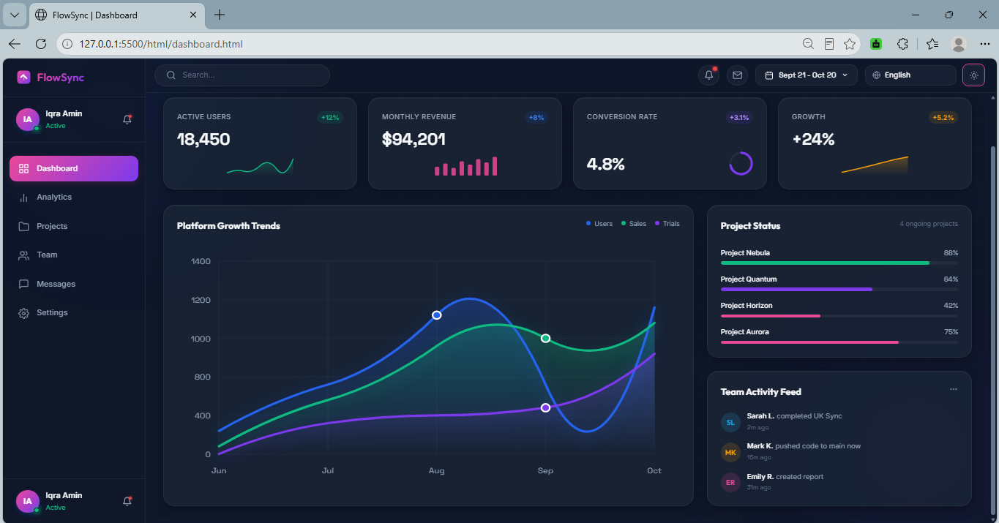

# 🚀 FlowSync – Modern SaaS Product Landing Page & Customer Onboarding Portal


<p align="center">
  
</p>
---

# 📖 Overview

FlowSync is a modern SaaS (Software as a Service) frontend application designed to showcase a professional software platform with a premium user experience.

The project includes a marketing landing page, customer onboarding flow, and an interactive dashboard preview. It focuses on responsive design, smooth animations, reusable components, accessibility, and modern UI/UX principles using only HTML, CSS, and JavaScript.

---

# ✨ Features

## 🌐 Landing Page

* Premium Hero Section
* Glassmorphism Navigation
* Product Overview
* Features Section
* Solution Showcase
* Customer Testimonials
* Pricing Plans
* FAQ Accordion
* Contact Section
* Professional Footer
* Infinite Logo Marquee
* Responsive Mobile Navigation

---

## 👤 Customer Onboarding

* Multi-step onboarding wizard
* Workspace selection
* Company information
* Team invitation
* Preferences setup
* Progress indicator
* Form validation
* Success page
* Automatic dashboard redirection

---

## 📊 Dashboard Preview

* Professional analytics dashboard
* KPI cards
* Interactive charts
* Recent activity feed
* User profile section
* Responsive sidebar
* Glassmorphism interface

---

## 🎨 UI / UX

* Glassmorphism design
* Dark / Light mode
* Smooth animations
* Responsive layout
* Mobile-first design
* Modern typography
* Consistent spacing
* Accessibility considerations

---

# 🛠️ Technologies Used

* HTML5
* CSS3
* JavaScript (ES6)
* Local Storage
* CSS Grid
* Flexbox

---

# 📁 Project Structure

```
FlowSync/
│
├── index.html
├── onboarding.html
├── success.html
├── dashboard.html
│
├── css/
│   ├── global.css
│   ├── landing.css
│   ├── onboarding.css
│   ├── dashboard.css
    ├── style.css
    ├── success.css
    ├── hero.css
│   └── responsive.css
│
├── js/
│   ├── app.js
│   ├── onboarding.js
│   ├── dashboard.js
│   └── success.js
│
├── assets/
│   ├── images/
│   └── screenshots/
│
└── README.md
```

---

# 🚀 Getting Started

Clone the repository

```
git clone https://github.com/iqraamin054-code/FlowSync.git
```

Open the project folder.

Run using Live Server or any local development server.

---

# 📸 Screenshots

## Hero Section



---

## Product Overview



---

## Features Section



---

## Customer Onboarding



---

## Dashboard



---

<div align="center">

## Mobile View


</div>

---

# 🎥 Demo

Demo Video:

(Add your video link here)


---

# 👩‍💻 Author

**Iqra Amin**

Frontend Developer

GitHub:
https://github.com/iqraamin054-code/FlowSync.git

LinkedIn:
www.linkedin.com/in/iqraamin-dev


