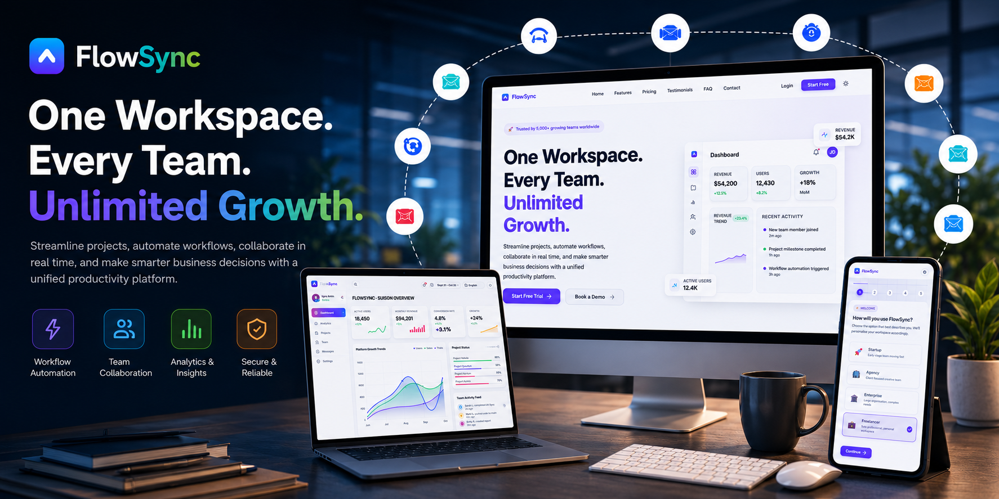
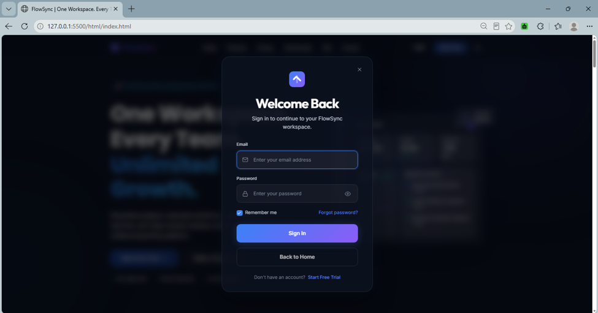

# 🚀 FlowSync – Modern SaaS Product Landing Page & Customer Onboarding Portal

<p align="center">
  
  
  
  
  
</p>

---

<p align="center">
  
</p>

---

# 📖 Overview

FlowSync is a modern SaaS (Software as a Service) frontend application designed to showcase a professional software platform with a premium user experience.

The project includes a marketing landing page, customer onboarding flow, and an interactive dashboard preview. It focuses on responsive design, smooth animations, reusable components, accessibility, and modern UI/UX principles using only HTML, CSS, and JavaScript.

---

# ✨ Features

## 🌐 Landing Page

* Premium Glassmorphism Navigation
* Responsive Hero Section
* Product Overview
* Interactive Solution Section
* Features & Benefits
* Customer Testimonials
* Pricing Plans
* Interactive Pricing Calculator
* Frequently Asked Questions
* Contact Section
* Professional Footer
* Infinite Trusted Companies Marquee
* Responsive Mobile Navigation

---

## 👤 Customer Onboarding

* Multi-step onboarding experience
* Progress indicator
* Company information collection
* Team invitation step
* Theme preference selection
* Language preference selection
* Form validation
* Success confirmation
* Automatic dashboard redirection

---

## 🔐 Frontend Authentication

* Glassmorphism Login Modal
* User Registration
* Login Validation
* LocalStorage Authentication
* Session Persistence
* Logout Functionality

---

## 📊 Dashboard Preview

* Professional analytics dashboard
* KPI cards
* Interactive charts
* Project Status
* Recent activity feed
* User profile section
* Responsive sidebar
* Glassmorphism interface

---

## 🎨 UI / UX Highlights

* Premium Glassmorphism Design
* Dark & Light Theme
* Smooth Animations
* Responsive Layout
* Modern Typography
* Consistent Design System
* Accessibility Considerations

---

# 🛠️ Technologies Used

* HTML5
* CSS3
* JavaScript (ES6)
* Local Storage API
* CSS Grid
* Flexbox

---

# 📁 Project Structure

```
FlowSync/
│
├── index.html
├── onboarding.html
├── success.html
├── dashboard.html
│
├── css/
│   ├── global.css
│   ├── landing.css
│   ├── onboarding.css
│   ├── dashboard.css
|   ├── style.css
|   ├── success.css
|   ├── hero.css
│   └── responsive.css
│
├── js/
│   ├── app.js
│   ├── onboarding.js
│   ├── dashboard.js
│   └── success.js
│
├── assets/
│   ├── videos/
|   |    └── FlowSync_Demo.mp4
|   └── screenshots/
|       ├── landing-page.png
│       ├── onboarding.png
│       ├── dashboard.png
│       ├── login-modal.png
│       ├── productoverview.png
│       ├── productoverview.png
│       ├── features.png
│       ├── FlowSync_Github_Banner.png
│       └── mobile-view.png
│
└── README.md
```

---

# 📸 Screenshots

## 🏠 Landing Page


---

## 💼 Product Overview


---

## ⭐ Features


---

## 👤 Customer Onboarding


---

## 📊 Dashboard


---

## 🔐 Login Modal



---

<div align="center">

## 📱 Mobile View


</div>

---

# 🚀 Getting Started

Clone the repository

```
git clone https://github.com/iqraamin054-code/FlowSync.git
```

Navigate to the project folder

cd FlowSync

Open index.html using Live Server or any local development server.

---

# 🎥 Demo

Demo Video:

[Watch Full Demo](assets/videos/Flowsync_Demo_Video.MP4)

---

# 👩‍💻 Author

**Iqra Amin**

Frontend Developer

GitHub:
https://github.com/iqraamin054-code/FlowSync.git

LinkedIn:
www.linkedin.com/in/iqraamin-dev

---

## 📄 License

This project was developed for educational and internship evaluation purposes.
